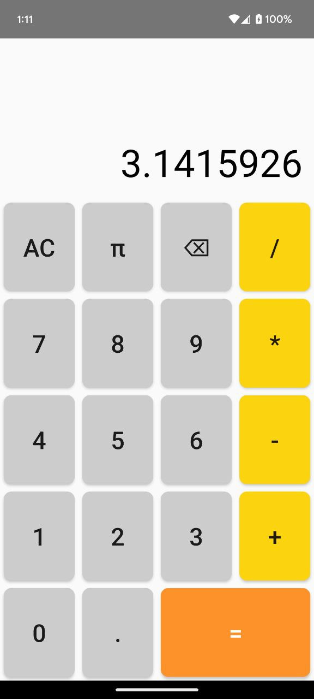

# Calculator Android App for Educational Purposes

A simple calculator developed for educational purposes, using Android and Kotlin. This project is intended to demonstrate the basics of Android app development, working with interfaces, mathematical operations, and fundamental Android components.

## Features

- Support for basic arithmetic operations: addition, subtraction, multiplication, and division.
- Intuitive interface with buttons for entering numbers and operators.
- Functionality implemented using Kotlin.
- Adaptive layout. It supports landscape orientation as well.

